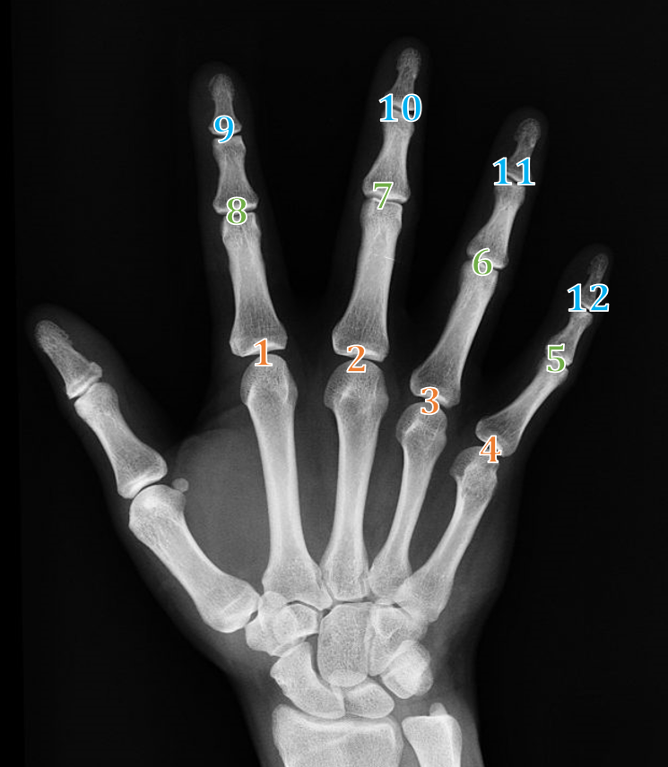

Program pro snadnou tvorbu výřezů kloubů z RTG snímků
========================================

Aktuálně umí:

-   V zadané složce a podložkách projít všechny soubory typu jpg, jpeg,
    png, tif a tiff.
-   Uživatel na každém snímku klikáním myší vyznačí pozice kloubů (v
    předem daném pořadí), program automaticky uloží výřez a pojmenuje
    ho.
-   Všechny výřezy mají rozlišení 299 x 299 pixelů, což je vstupní rozměr do
    Inception. Program zachovává původní příponu snímků (např. výřez z png bude
    opět png).

