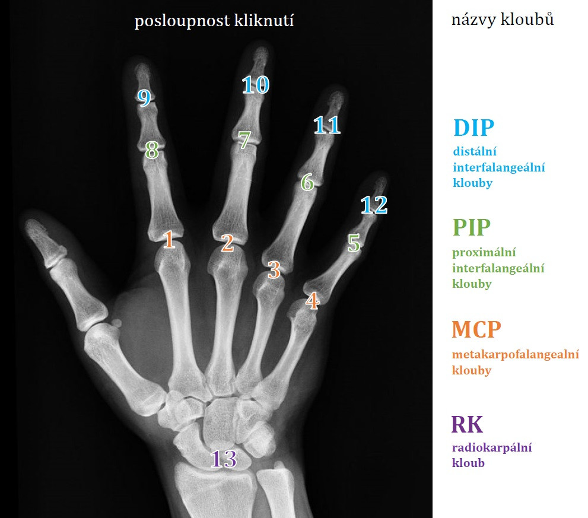

Program pro snadnou tvorbu výřezů kloubů z RTG snímků
========================================
**Program projde jednotlivé snímky ve složce, uživatel klikáním myší
vytváří ze snímku čtvercové výřezy (v předem daném pořadí). Je to
nejrychlejší možný způsob vytváření výřezů. Program je plně podřízen
jedinému účelu – vytvořit z RTG snímků celých rukou nový dataset snímků
jednotlivých kloubů.**

# Vstupy a výstupy
## Vstupy
-  Obrázek, resp. složka s obrázky k rozřezání. (Program automaticky
   zahrne do zpracování i snímky v podložkách.)

## Výstupy
Pro každý jeden snímek:
-   Výřezy kloubů (jeden výřez za každé kliknutí myší). Každý výřez se
    ukládá ve dvou velikostech, a to
    - absolutní velikost 299 x 299 px, se kterou pracuje Inception
    - relativní velikost vypočítaná podle velikosti původního snímku
-   Výřezy se ukládají do dvou výstupních složek podle velikosti. Tyto
    složky si program sám vytvoří v zadané složce se vstupními snímky.
-   Soubor obsahující souřadnice označených kloubů pro případné další
    zpracování nebo úpravy – ukládá se do vstupní složky k původnímu
    snímku
    
# Ovládání programu
1. Do kódu je potřeba zadat adresu složky se vstupními snímky a program
   spustit
2. Program postupně prochází a zobrazuje jednotlivé snímky ve složce.
   Klikáním myší se označují klouby. Ke každému kliknutí program vytvoří
   výřez označeného kloubu a bokem uloží jeho souřadnice pro případné
   další využití. Kolečkem myši je možné měnit velikost výřezu.
3. Klouby se automaticky pojmenovávají v pořadí zobrazeném na obrázku
   níže. Toto pořadí je při klikání nutné dodržet, jinak budou výřezy
   pojmenované špatně. Pokud nějaký kloub na snímku ruky chybí (amputace
   apod.) je přesto potřeba někam kliknout. Ukázkový obrázek znázorňuje
   pravou ruku, v případě levé ruky je nutné zachovávat stejné pořadí
   prstů (tzn. začínat u ukazováčku a končit u malíčku)
   
   
   
4. Na další snímek se přejde po stisknutí libovolné klávesy. 
5. Pro projdutí všech snímků ve složce se program sám ukončí.

# Podrobný popis funkčnosti
-   V zadané složce i podložkách program hledá všechny soubory s
    příponami jpg, jpeg, png, tif a tiff.
-   Uživatel na každém snímku klikáním myší vyznačí pozice kloubů,
    program automaticky uloží výřez a pojmenuje ho složením původního
    názvu souboru a lékařského označení daného kloubu. Aktuální oblast k
    vyřezání program ve snímku zvýrazní barevným rámečkem.
-   Je ošetřeno, že nelze vyznačit více než 12 uvedených kloubů.
-   Všechny výřezy kloubů prstů mají rozlišení (absolutní) 299 x 299
    pixelů, což je vstupní rozměr do neuronové sítě architektury
    Inception. Kloub zápěstní má větší (absolutní) rozměr 500 x 500 px.
    Relativní rozměry se vypočítávají jako určité % z rozměru původního
    snímku. % bylo stanoveno pokusem, není za tím schovaná žádná
    pokročilejší metoda (i když by to asi bylo žádoucí). Velikost
    relativního výřezu je možné měnit kolečkem myši.
-   K výřezům příliš blízko okrajů, které by jinak měly rozměr menší, se
    dolepí prázdné černé místo tak, aby zmíněné rozlišení zůstalo
    zachováno. Tuto funkci je možné vypnout nastavením příslušného
    parametru na False.
-   Výřezy zachovávají původní příponu snímků (např. výřez z png bude
    opět png).
-   Do složky se vstupním snímkem se ukládají i metadata – souřadnice
    označených kloubů. Souřadnice si knihovna OpenCV sama přepočítá z
    rozměrů okna se snímkem na rozměry skutečného snímku.
-   Metadata se ukládají ve formátu, který je čitelný pouze strojově, a
    lze je přečíst v jiném programu napsaném v Pythonu (součástí tohoto
    repozitáře). Metadata se ukládají pomocí knihovny Pickle jako
    serializovaný výstup programátorských objektů. Tyto objekty
    využívají datovou strukturu *slovník*. Pro jeden snímkem vznikne
    jeden slovník, kde klíčem je lékařská zkratka kloubu a hodnotou je
    pole se souřadnicemi *x* a *y*.
-   CHYBÍ: možnost k výřezům ukládat popisky (diagnóza, míra poškození,
    apod.)
-   CHYBÍ: automatické přizpůsobení velikosti výřezu podle rozměrů
    obrázku

